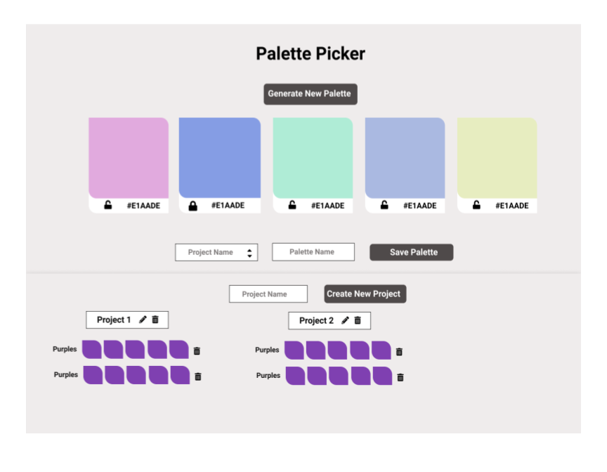

# Palette Picker
Looking for color inspiration for your next website or project? Palette Picker is a full stack application that quickly generates color palettes, which users can tailor and save for future reference.  

### See it live:

Associated backend repo: https://github.com/dylhof/palette-picker-be  
### Preview:  

### Primary Technologies Used:
* React 
* Redux
* PostgreSQL
* Node.js
* Express
* Knex
* JavaScript
* SCSS  

### Testing:
Jest and Enzyme for front end and back end testing 

### Original Assignment:  
[Palette Picker](http://frontend.turing.io/projects/palette-picker.html)  

### Contributors:  
[Dylan Hofmann]()  
[Tiffany Bachmann]()  

### Wireframe:  

This project was bootstrapped with [Create React App](https://github.com/facebook/create-react-app).